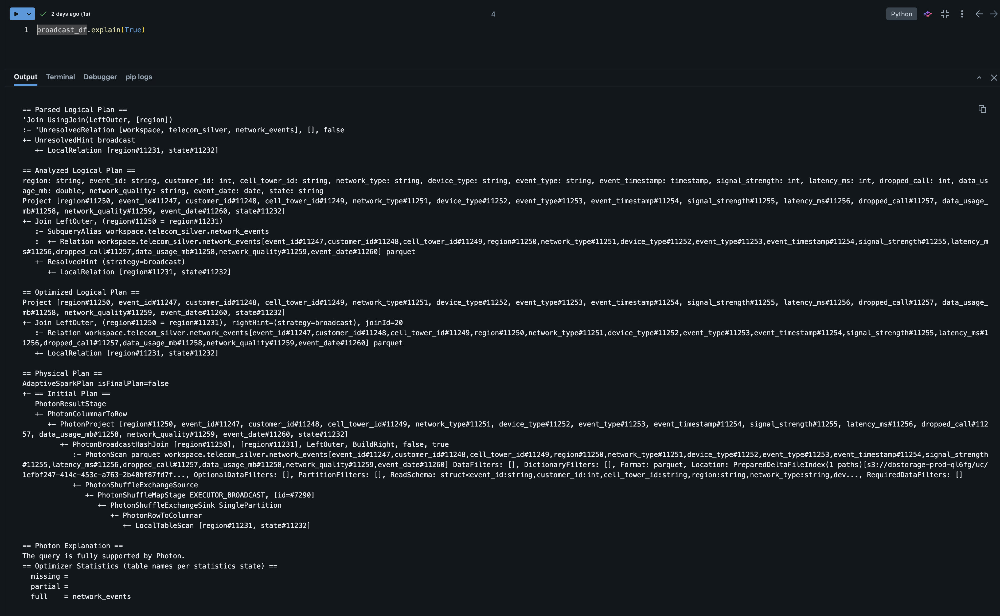

# Databricks Telecom Lakehouse Analytics

End-to-End Telecom Analytics Pipeline using Databricks, PySpark, Delta Lake, Unity Catalog, and Medallion Architecture.

---

## Project Overview

This project simulates a telecom network analytics platform built on Databricks Lakehouse architecture.

The solution processes telecom network event data through Bronze, Silver, and Gold layers while applying data quality rules, optimization techniques, and business KPI aggregations.

Dataset size: 50,000+ telecom network events.

---

## Technologies Used

- Databricks Free Edition
- PySpark
- Delta Lake
- Unity Catalog
- SQL
- Photon Engine
- Delta MERGE
- Broadcast Joins
- Partition Pruning

---

## Architecture


---

## Bronze Layer

### Objective

Ingest raw telecom event files into Delta Lake.

### Activities

- Read CSV files from Unity Catalog Volumes
- Schema inference
- Raw data persistence
- Delta table creation

Output Table:

```text
workspace.telecom_bronze.network_events
```

---

## Silver Layer

### Objective

Apply data quality validations and cleansing.

### Activities

- Deduplication
- Signal strength validation
- Latency validation
- Rejected record handling
- Network quality classification

Output Tables:

```text
workspace.telecom_silver.network_events
workspace.telecom_silver.network_events_rejected
```

---

## Gold Layer

### Objective

Generate business-ready KPIs.

### Activities

- Regional analytics
- Network performance metrics
- Data quality summaries
- Daily KPI generation

Output Tables:

```text
workspace.telecom_gold.network_kpi_daily
workspace.telecom_gold.data_quality_summary
```

---

## Optimization Techniques Implemented

### Broadcast Joins

Used broadcast joins for small lookup datasets to avoid expensive shuffles.

### Delta MERGE

Implemented upsert operations using Delta Lake MERGE.

### Partition Pruning

Demonstrated query optimization using partition filters.

### Repartition vs Coalesce

Compared partition management strategies for performance optimization.

### Data Skew Handling

Implemented salting techniques to mitigate skewed joins.

---

## Sample Results

### Data Quality Dashboard


### KPI Reporting


### Query Optimization



---

## Future Enhancements

- Structured Streaming
- Auto Loader
- Event Hubs Integration
- Delta Live Tables
- CI/CD Deployment

---

## Author

Karthik Kommarraju
Senior Data Engineer